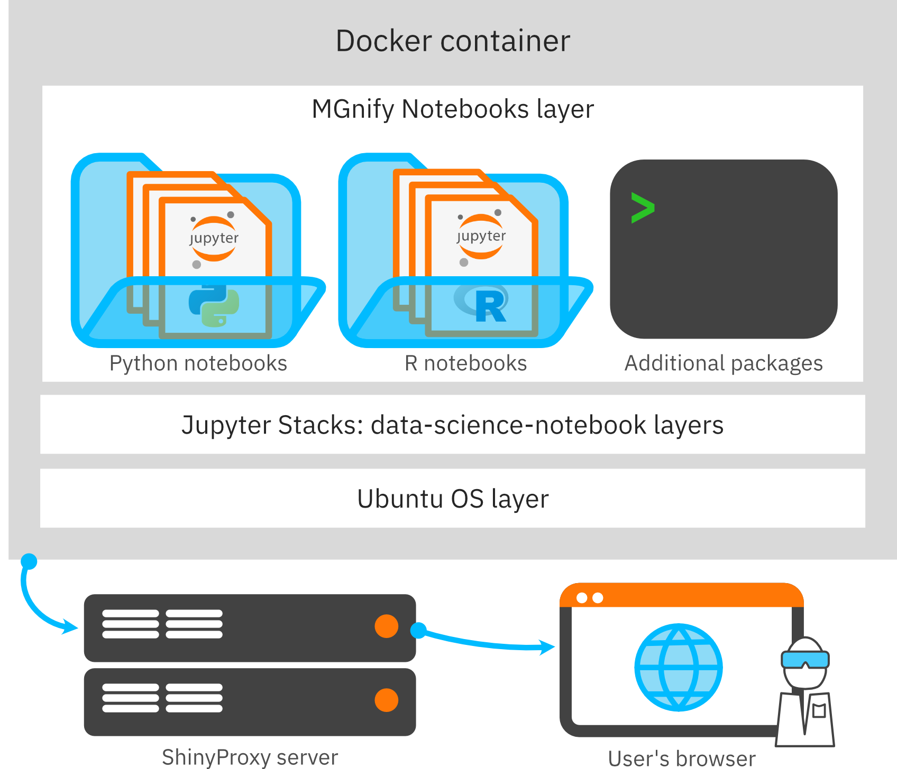
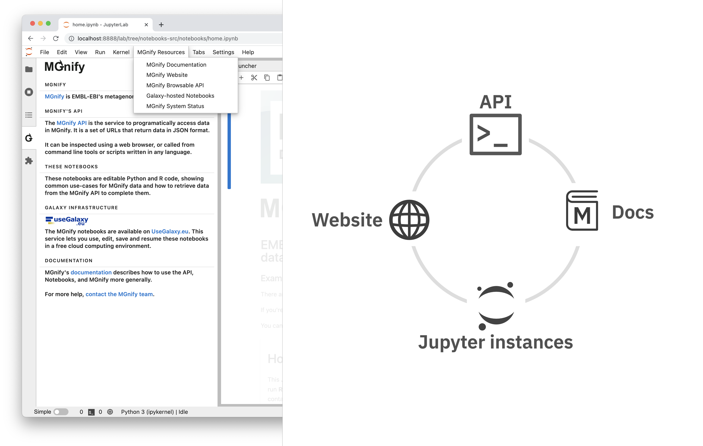

# Introduction

During and around the BioHackathon Europe 2022, we introduced several developments to the "MGnify Notebook Server" ranging from running on new infrastructure to adding new content and documentation.

[MGnify](https://www.ebi.ac.uk/metagenomics) [@Mitchell2020-sz] is EMBL-EBI’s metagenomics resource, which is part of the ELIXIR Metagenomics Community. 
In the last year, MGnify launched a Notebook Server to provide an online Jupyter Lab 
[@Kluyver2016jupyter] environment for users to explore programmatic access to MGnify’s datasets using Python or with R. 
This ready to use environment and example analysis notebooks bridge the gap between the ease but limitations of browsing the MGnify website, and the complexity but possibilities of installing a local environment to work with data stored in MGnify. 
Particular goals of the Notebook Server include reproducible downstream analyses, user empowerment through best-practice examples and fast workflows from datasets to publication-ready graphics, and code-as-documentation training materials for users of MGnify.

As a young resource, there were potential improvements to be made across the entire technology and content stack (figure \ref{schematic}).

# Developments

## MGnify notebooks running on Galaxy infrastructure
The MGnify Notebooks architecture is designed to be broadly host-agnostic.
The notebooks are standard Jupyter notebooks and, following installation of the necesary language kernels and packages, can be used on any computer.
The libraries and versions used are listed in Conda [@anaconda] environment files, which helps accelerate the installation and ensure the reproducibility of environments.
Finally, the environment and notebooks are packaged as Docker [@merkel2014docker] images and these images are the primary way to use the MGnify Notebooks.

Prior to BioHackathon Europe 2022, MGnify Notebooks were deployed to one publicaly available server: a [ShinyProxy](https://www.shinyproxy.io/) server hosted by EMBL's Bio-IT project.

This deployment allows anonymous, no-login-required usage of the notebooks, providing a simple discovery path for new users.
This also makes the server suitable for "deep-linking": the lack of a login process means notebooks can be launched into a particular state using URL query parameters.

However, the resources available on this single server are limited, and need to be constrained per user to prevent abuse.
Likewise, inactive Jupyter Lab instances need to be quickly shut down and persistence of user data cannot be guaranteed for extended periods of time.

Galaxy [@Galaxy] instances provide infrastructure and environments for scientific computing, including (authenticated) per-user resources for compute and data storage.
During BioHackathon Europe 2022, we added the MGnify Notebooks Docker images as interactive tools on the [Galaxy Eurpoe](https://usegalaxy.eu/) instance and associated [Galaxy Europe Live](https://live.usegalaxy.eu/) – a Galaxy instance highlighting the interactive tools available on the platform.

The Galaxy deployment complements the ShinyProxy deployment by providing persistent data storage for each user, to customise and build upon the notebooks for their own purposes, as well as more powerful compute; whereas the ShinyProxy deployment continues to provide a less isolated environment that can be more tightly coupled to the [MGnify website](https://www.ebi.ac.uk/metagenomics) through deep links.

## Enhanced documentation and clearer user journeys
Previously, users were most likely to discover the MGnify Notebooks resource by following a journey beginning on the MGnify website.
One perceived risk in surfacing the MGnify Notebooks elsewhere – on community platforms like Galaxy – is that users may not have that the same context in terms of information about the broader MGnify resource.

During BioHackathon Europe 2022, we therfore developed a Jupyter Lab user interface (UI) extension that places MGnify-specific help and resources into Jupyter Lab.
The extension provides a help panel with explaining how the notebooks relate to the broader MGnify resource, and a menubar list of links to the resources as shown in figure \ref{help-extension}

We envisage this being useful for:
- users discovering the notebook on Galaxy to learn more about MGnify
- users needing quick access to MGnify's interactive API browser when fetching data in notebooks
- users working on the ShinyProxy deployment looking for an environment to save and resume their work.

## Improving interoperability of IGV as a Jupyter Lab Widget
IGV (the Integrative Genomics Viewer) and its javascript implementation `IGV.js` [@IGVjs] are interactive tools for exploring genomes and annotations.

The MGnify website uses `IGV.js` to visualise genomes and assembly contigs from metagenomic-derived datasets.
Whilst expanding the MGnify notebooks to cover more datatypes, we found a need to include a visualisation like IGV in some notebooks – particularly when developing notebooks to analyse MGnify's Metagenome Assembled Genome (MAG) catalogues.

An existing project – [`igv-jupyterlab`](https://github.com/epi2me-labs/igv-jupyterlab) – wraps `IGV.js` into a Jupyter Lab widget.
Jupyter Lab widgets are hybrid web/kernel components that can communicate between a user interface built using web-technologies and the running Jupyter kernel (i.e. Python) runtime.
In this case, a Python method can be used to instantiate an IGV instance in a notebook cell.

During BioHackathon Europe 2022, we contributed a feature to the `igv-jupyterlab` project enabling Python functions – or other Jupyter Lab widgets – to be run when an annotation is clicked in IGV.
This enables richer notebook workflows than would otherwise be possible with the default IGV behaviour of showing a popup with the focussed annotation's details.

For example, a user could load a MGnify genome and its GFF annotation file, and when clicking on a coding sequence annotation perform an API (Application Programming Interface) call to the InterPro API [@interpro], constructing a dataframe of relevant protein information.

## Integration between MGnify's Protein Database and ESM Atlas

## Notebooks covering MGnify's metagenome-assembled genomes

# Discussion

...

## Acknowledgements

Elixir, HoloFood

## References
