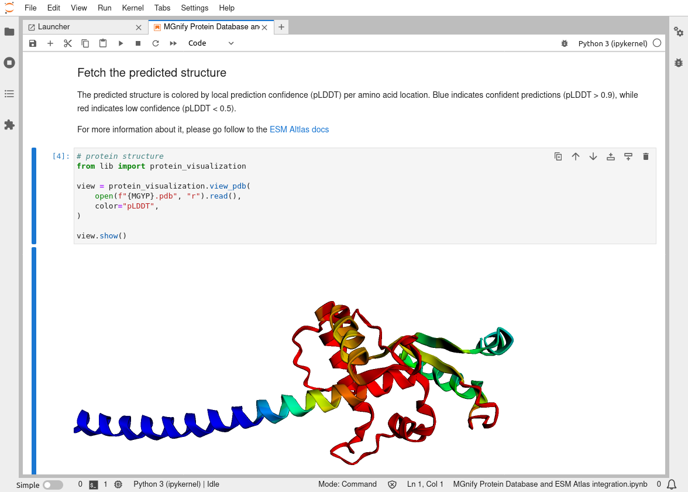

# Introduction

[MGnify](https://www.ebi.ac.uk/metagenomics) [@citesAsAuthority:10.1093/nar/gkac1080] is EMBL-EBI’s metagenomics resource, which is part of the ELIXIR Metagenomics Emerging Community. 
In the last year, MGnify launched a Notebook Server to provide an online Jupyter Lab 
[@usesMethodIn:Kluyver2016jupyter] environment for users to explore programmatic access to MGnify’s datasets using Python or with R. 
This ready to use environment and example analysis notebooks bridge the gap between the ease but limitations of browsing the MGnify website, and the complexity but possibilities of installing a local environment to work with data stored in MGnify. 
Particular goals of the Notebook Server include reproducible downstream analyses, user empowerment through best-practice examples and fast workflows from datasets to publication-ready graphics, and code-as-documentation training materials for users of MGnify.

The Notebook Server exists alongside other MGnify support resources including the [formal MGnify documentation](https://docs.mgnify.org) and [EMBL-EBI Training](https://www.ebi.ac.uk/training/) courses and materials.
More broadly, resources like the [Galaxy Training Network's metagenomics topic](https://training.galaxyproject.org/training-material/topics/metagenomics/) [@citesAsAuthority:gtn] provide tutorials and compute infrastructure for metagenomics training without a specific focus on one service.
In this context the MGnify notebooks' niche is delivering ready-to-use examples of consuming data from the MGnify API (Application Programming Interface) in common downstream metagenomic analysis tasks.

During and around the BioHackathon Europe 2022, we introduced several developments to the "MGnify Notebook Server" ranging from running on new infrastructure to adding new content and documentation.
As a young resource, there were potential improvements to be made across the entire technology and content stack (figure \ref{schematic}).
Here we describe each of the major areas of development.


# Developments

## MGnify notebooks running on Galaxy infrastructure
The MGnify Notebooks architecture is designed to be broadly host-agnostic.
The notebooks are standard Jupyter notebooks and following installation of the necesary language kernels and packages can be used on any computer.
The libraries and versions used are listed in Conda [@usesMethodIn:anaconda] environment files, which helps accelerate the installation and ensure the reproducibility of environments.
Finally, the environment and notebooks are packaged as Docker [@usesMethodIn:merkel2014docker] images and these images are the primary way to use the MGnify Notebooks.

Prior to [BioHackathon Europe 2022](https://biohackathon-europe.org/), MGnify Notebooks were deployed to one publicaly available server: a [ShinyProxy](https://www.shinyproxy.io/) server hosted by EMBL's Bio-IT project.

This deployment allows anonymous, no-login-required usage of the notebooks, providing a simple discovery path for new users.
This also makes the server suitable for "deep-linking": the lack of a login process means notebooks can be easily launched into a particular state using URL query parameters.

However, the resources available on this single server are limited, and need to be constrained per user to prevent abuse.
Likewise, inactive Jupyter Lab instances need to be quickly shut down and persistence of user data cannot be guaranteed for extended periods of time.

Galaxy [@citesAsPotentialSolution:Galaxy] instances provide infrastructure and environments for scientific computing, including (authenticated) per-user resources for compute and data storage.
During BioHackathon Europe 2022, we added the MGnify Notebooks as an interactive tool on the [Galaxy Eurpoe](https://usegalaxy.eu/) instance and associated [Galaxy Europe Live](https://live.usegalaxy.eu/) – a Galaxy instance highlighting the interactive tools available on the platform.

The Galaxy deployment complements the ShinyProxy one by providing persistent data storage for each user, to customise and build upon the notebooks for their own purposes, as well as more powerful compute infrastructure; whereas the ShinyProxy deployment continues to provide a less isolated environment that can be more tightly coupled to the [MGnify website](https://www.ebi.ac.uk/metagenomics) through deep links.

## Enhanced documentation and clearer user journeys
Previously, users were most likely to discover the MGnify Notebooks resource by following a journey beginning on the MGnify website.
One perceived risk in surfacing the MGnify Notebooks elsewhere – on community platforms like Galaxy – is that users may not have that the same context in terms of information about the broader MGnify resource.

During BioHackathon Europe 2022, we therefore developed a Jupyter Lab user interface (UI) extension that places MGnify-specific help and resources into Jupyter Lab.
The extension provides a help panel explaining how the notebooks relate to the broader MGnify resource, and a menubar list of links to the resources as shown in figure \ref{help-extension}.

We envisage this being useful for:

- users discovering the notebook on Galaxy to learn more about MGnify,
- users needing quick access to MGnify's interactive API browser when fetching data in notebooks,
- users working on the EMBL's Bio-IT ShinyProxy deployment looking for an environment to save and resume their work.


## Improving interoperability of IGV as a Jupyter Lab Widget
IGV (the Integrative Genomics Viewer) and its javascript implementation `IGV.js` [@usesMethodIn:IGVjs] are interactive tools for exploring genomes and annotations.

The MGnify website uses `IGV.js` to visualise genomes and assembly contigs from metagenomic-derived datasets.
Whilst expanding the MGnify notebooks to cover more datatypes, we found a need to include a visualisation like IGV in some notebooks – particularly when developing notebooks to analyse MGnify's Metagenome Assembled Genome (MAG) catalogues.

An existing project – [`igv-jupyterlab`](https://github.com/epi2me-labs/igv-jupyterlab) – wraps `IGV.js` into a Jupyter Lab widget.
Jupyter Lab widgets are hybrid web/kernel components that can communicate between a user interface built using web-technologies and the running Jupyter kernel (e.g. Python) runtime.
In this case, a Python method can be used to instantiate an IGV instance in a notebook cell.


During BioHackathon Europe 2022, we contributed a feature to the `igv-jupyterlab` project enabling Python functions – or other Jupyter Lab widgets – to be run when an annotation is clicked in IGV.
This enables richer notebook workflows than would otherwise be possible with the default IGV behaviour of showing a popup with the focussed annotation's details (figure \ref{igv}).

For example, a user could load a MGnify genome and its GFF annotation file, and when clicking on a coding sequence annotation perform an API call to the InterPro API [@usesDataFrom:interpro], constructing a dataframe of relevant protein information.

## Integration between MGnify's Protein Database and ESM Atlas
Predicting the 3D structure of proteins is a crucial step in understanding their biology. Meta AI's ESMFold [@citesAsPotentialSolution:ESMfold2] is a tool designed for this purpose, using machine learning for protein structure prediction.

The [ESM Metagenomic Atlas](https://esmatlas.com/) is a comprehensive repository of protein structures that have been generated using the ESMFold tool, sourced from the MGnify Protein Database. It serves as a convenient resource for researchers interested in exploring and comparing the structures of proteins predicted by ESMFold. However, the Atlas currently lacks easily accessible metadata for the proteins. This information is stored in flat files on the [MGnify FTP server](ftp://ftp.ebi.ac.uk/pub/databases/metagenomics/peptide_database/current_release/), which can be difficult for many users to access. During BioHackathon Europe 2022, our team worked on a prototype for a web API that would provide access to this metadata stored in the MGnify Protein Database.

We explored the potential of combining the Atlas web API and the newly developed API to integrate protein structure with metadata by using a Jupyter notebook. This approach allows researchers to easily access and analyze protein structure and metadata from both MGnify and the Atlas within a single platform. 



In addition, this Jupyter notebook includes a section that allows researchers to run a sequence similarity search using the MGnify Sequence Search API, and incorporates the muscle [@usesMethodIn:MUSCLE] multiple sequence aligner to generate an alignment using the top 10 hits obtained. Overall, this notebook provides a convenient way for users to access and analyze protein structure and metadata in a single platform (figure \ref{protein-db}).

## Notebooks covering MGnify's metagenome-assembled genomes

As we've seen, the notebooks are primarily a resource to share examples of how to use and connect to the MGnify API. 

During BioHackathon Europe 2022, we created a python notebook providing an overview of the use of the [`MGnify's metagenome-assembled genomes (MAGs) API`](https://www.ebi.ac.uk/metagenomics/api/v1/genomes). 
This new notebook is divided in five main sections, conceptually building from introducing basic libraries to access and plot the data up to comparing user-generated genomes against the MGnify resource.

### Basic libraries
The first section provides the users with an example of Python libraries that can be used to explore and plot data retrieved from the genome API. 
In particular this notebook introduces the PySpark [@usesMethodIn:pyspark] as one of the libraries the notebooks showcase, adding diversity to the examples.


### Data access
The second section illustrates how to query the [`genomes`](https://www.ebi.ac.uk/metagenomics/api/v1/genomes) database from the MGnify API (as shown below) as well as how to save queried data and reload previously saved data.

```python
# variables
endpoint_name = 'genomes'
genus_filter = 'Listeria'

# code to query the genomes 
with APISession(
    "https://www.ebi.ac.uk/metagenomics/api/v1"
) as mgnify:
    search_filter = Modifier(
        f"taxon_lineage={genus_filter}"
    )
    resources = map(
        lambda r: r.json,
        mgnify.iterate(
            endpoint_name, 
            filter=search_filter
        )
    )
    resources_df = pd.json_normalize(
        resources
    )
```

### Genome data exploration
The third section is related to the dataset exploration. For instance, it describes how to check for missing values, how to obtain statistical metrics (average, standard deviation, minimum, maximum) on numerical columns such as the genome GC-content or length, and how to query the most represented genus in the dataset (figure \ref{data-exploration}).


### Plotting data from the genomes resources
The fourth section provides example plots – and the code to produce them – that can be made from the genome dataset. 
Three types of graphics are illustrated in this section: a Sankey diagram (figure \ref{graphics}a), boxplots (figure \ref{graphics}b), and histograms (figure \ref{graphics}c).


### Sequence search
Finally, the last section of this notebook describes step-by-step how users can compare their own MAGs against MGnify's genome catalogues, for example to determine if their own MAGs represent novel species in a certain biome.
In brief, it explains how to create a signature for each MAG using [`Sourmash`](https://sourmash.readthedocs.io/en/latest/index.html#sourmash-in-brief) [@usesMethodIn:sourmash].
The signature is then used to search for corresponding MAGs within the [`MAG catalogues`](https://www.ebi.ac.uk/metagenomics/api/v1/genomes-search/gather) and to fetch their corresponding taxonomic lineage for instance. 

The MGnify genomes resource provides geographic extent information for each MAG, so the notebooks also include examples of how this metadata can be visually mapped (figure \ref{maps}).

![Map examples: a) Interactive map representing the number of genomes according to their geographical origin. Hovering continents with the mouse curser allows to see the exact count per continent. b) Interactive map representing the localisation of the samples. Each blue dots represents the proportion of samples for a given longitude-latitude set. c) Zoom in b) on a sampling region of interest. d) In addition to the number of samples and the longitude and latitude, hovering the blue dots with the mouse cursor allow the users to display additional related information such as the ID of the study, the sample IDs and the genome IDs, when available. \label{maps}](./figures/maps.png)

The code and examples used in this notebook illustrate the range of data and features in MGnify's genomes API, and allow less experimented users to re-use sample code for their own purpose. 

# Discussion
MGnify's publicly available Jupyter Lab instances and notebooks are a collection of resources that aim to empower the microbiome research community with streamlined access to EMBL-EBI's metagenomic-derived datasets. 
Through "code as documentation" and ready-to-use compute environments, users can acomplish short programmatic access tasks (like building a TSV file of data requiring multiple API requests) or follow more in-depth analysis workflows than are possible on the MGnify website (like cross-study comparisons).

During and around BioHackathon Europe 2022, we developed this resource at multiple levels.
At the infrastructure level, the MGnify notebooks are now an [interactive tool on the Galaxy Europe platform](https://usegalaxy.eu/root?tool_id=interactive_tool_mgnify_notebook).
At the content level, notebooks were developed to cover more widely used datasets including MGnify Genomes and the MGnify Protein Database.
At the interface level, Jupyter Lab extensions and widgets were developed to improve interopability of the notebooks with the wider ecosystem.
Finally in terms of community engagement and future expansion, we have created shorter workflows for suggesting, requesting and contributing new notebooks in future. A [Taskfile](https://taskfile.dev) simplifies the development experience and [GitHub issue templates](https://github.com/EBI-Metagenomics/notebooks/issues/new/choose) encourage community suggestions.

## Acknowledgements

We thank ELIXIR, the research infrastructure for Life-science data, and the organisers of BioHackathon Europe 2022 for funding the travel costs of some authors.

This project has received funding from the European Union’s Horizon 2020 research and innovation programme under grant agreement No 817729.

We are grateful to Grace Hall and Björn Grüning for their suggestions and involvement during BioHackathon Europe 2022, and Ekaterina Sakharova and Alejanda Escobar-Zepeda for their contributions to the notebooks outside of the hackathon context.

We thank Jean-Karim Hériché for establishing hosting and continuous integration for the Jupyter notebooks within EMBL’s de.NBI cloud.

## References
